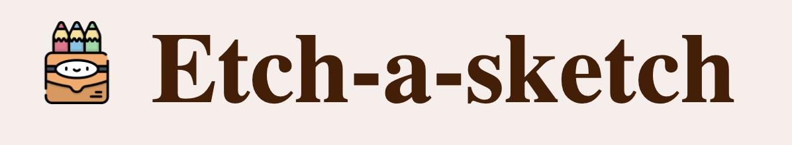

# TOP Etch-a-Sketch

  

## Overview
Welcome to the TOP (The Odin Project) Etch-a-Sketch!
This Etch-a-Sketch project is an interactive web application allowing users to create pixel art. Built with HTML, CSS, and JavaScript, it features a customizable grid where users can draw, apply colors, and use various modes.

## Features
- Dynamic Grid: Create a grid of any size for drawing.
- Drawing Modes: Includes Color, Rainbow, Eraser, and Gray Scale modes.
- Responsive Design: Adaptively fits different screen sizes.
- Interactive Buttons: For grid resizing, mode selection, and clearing the canvas.

## Usage
Access the Etch-a-sketch through [this link](https://naiminafis.github.io/etch-a-sketch/) . On the screen, you'll see the 16x16 canvas to unleash your creativity by: 
- Drawing: Click and drag on the grid to draw.
- Changing Modes: Select your desired mode using the buttons.
- Resizing Grid: Adjust the grid size as needed.

## Contributing
Contributors are always welcome to make contributions to this project and help improve it. If you'd like to contribute or work on available issues, feel free to do so. Let's collaborate and make this calculator even better!

## Happy Drawing!
I hope you find this TOP's 4th project useful and enjoy using it for your drawings. If you have any questions or suggestions, please don't hesitate to reach out to [Naimi Nafis](https://github.com/NaimiNafis).

## *Copyright Reserved:*

1. Picture by Freepik: https://www.flaticon.com/free-icon/colored-pencils_603548?term=draw&page=1&position=30&origin=search&related_id=603548

2. Picture by Ruslan Babkin: https://www.flaticon.com/free-icon/github_2504911?term=github&page=1&position=10&origin=search&related_id=2504911

## License
This project is open source and available under the MIT License.